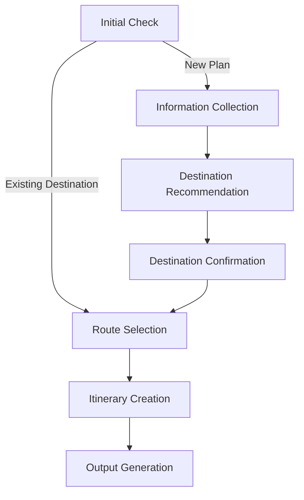
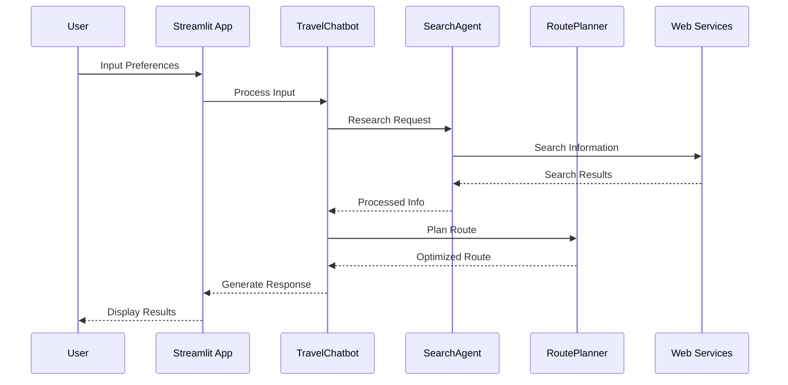

# MakeYourTrip - AI Travel Planning Assistant

An intelligent travel planning assistant powered by GPT-4, Langchain Agents, and Streamlit that helps users create personalized travel itineraries through natural conversation. The system uses real-time web searches to provide up-to-date information about weather, prices, and popular routes.

## Showcase

### 🏞️ Landing Page
Embark on your journey with Make Your Trip, an intuitive AI-powered travel planner that effortlessly guides travelers from initial inspiration to a fully personalized itinerary—all within a seamless and user-friendly experience.


### 💬 Information Gathering
Experience an engaging conversational interface where the AI travel assistant collects your unique preferences. This screenshot illustrates how the system intuitively guides users through personalized travel preference setup, tailored here for a tropical surf getaway.


### 🌍 Destination Selection
The Destination Selection module smartly converts your travel desires into tailored recommendations. It showcases detailed comparisons of destinations with costs, highlights, and weather, complemented by an interactive global map that helps travelers visually discover their next adventure.


### 📅 Itinerary Creation
Once the user has decided where to go, given MYT suggestions, it's time to plan!
This interactive planning enables clear visualization of the travel route and budget breakdown.

And follow in a map where this new journey will bring you!


### 📊 Excel with Trip Details and Costs
The app generates a comprehensive Excel itinerary that breaks down a full trip—such as this Tanzania adventure—into daily activities, expenses, and logistics. This organized roadmap provides clarity, making complex travel planning manageable and transparent for unforgettable experiences.


## 🌟 Features

### 🤖 Smart Planning Process
- **Initial Check**: Determines whether to start from preferences or jump to route selection
- **Multi-Stage Planning**:
  1. Information Collection
  2. Destination Recommendation
  3. Destination Confirmation
  4. Route Selection
  5. Itinerary Creation
  6. Output Generation

### 🎯 Core Functionalities

#### 1. Information Collection
- **Primary Requirements**
  - Travel dates with flexibility range
  - Trip duration including transit time
  - Departure location and nearby airports
  - Number of travelers and special needs
  - Budget breakdown (accommodation/activities/transport)

- **Travel Preferences**
  - Climate and seasonal preferences
  - Trip purpose (business/leisure/adventure)
  - Interests (cultural/historical/nature)
  - Geographical preferences

#### 2. Smart Destination Matching
- Weighted scoring system for preference matching
- Seasonal tourism data analysis
- Budget validation
- Travel time and connection optimization
- 5 personalized recommendations including:
  - Preference matching summary
  - Optimal visit timing
  - Cost estimates
  - Visa requirements
  - Major attractions

#### 3. Route Planning
- 3 unique route options per destination
- Customizable route combinations
- Real-time route popularity analysis
- Preference-based optimization

#### 4. Comprehensive Itinerary Creation
- **Accommodation**
  - Location-based recommendations
  - Price comparison
  - Proximity analysis

- **Transportation**
  - Flight options and booking info
  - Local transport recommendations
  - Inter-location transfers

- **Activities**
  - Day-by-day scheduling
  - Weather-dependent alternatives
  - Dining recommendations
  - Booking resources
  - Guide/tour options

- **Travel Essentials**
  - Weather-based packing lists
  - Emergency contacts
  - Currency information
  - Local customs guide
  - Insurance options

### 🎨 Interactive Interface
- Dynamic maps with route visualization
- Downloadable PDF itineraries
- Excel budget breakdowns
- Calendar integration
- Centralized booking links
- Real-time weather forecasts
- Transportation schedules

### 🔄 Planned Features
- Save/resume functionality
- Preference editing
- Itinerary sharing
- Multi-format exports
- Trip checklist generation
- Emergency contact cards

## 🏗️ Project Structure

```
main_MYT/
├── agents/                 # AI agent components
│   ├── context_orchestrator.py
│   └── travel_search_agent.py
├── utils/                 # Utility functions
│   ├── display_excel_utils.py
│   └── geo_utils.py
├── search/               # Search functionality
│   └── travel_utils.py
├── docs/                 # Documentation
│   └── execution_flow.drawio
├── assets/              # Static assets
├── streamlit_app.py     # Main application
├── travel_chatbot.py    # Core chatbot logic
└── prompts.py          # Conversation prompts
```

## 🚀 Getting Started

1. **Prerequisites**
   ```bash
   python -m venv venv
   source venv/bin/activate  # On Windows: venv\Scripts\activate
   pip install -r requirements.txt
   ```

2. **Environment Setup**
   Create a `.env` file with:
   ```
   OPENAI_API_KEY=your_api_key_here
   ```

3. **Running the App**
   ```bash
   streamlit run streamlit_app.py
   ```

## 💡 How It Works

### 1. Conversation Flow
The system maintains a natural conversation while guiding users through the planning process:



### 2. Planning Stages

```mermaid
stateDiagram-v2
    [*] --> InitialCheck
    InitialCheck --> Stage1: New Plan
    InitialCheck --> Stage4: Has Destination
    
    state Stage1 {
        [*] --> CollectDates
        CollectDates --> CollectDuration
        CollectDuration --> CollectLocation
        CollectLocation --> CollectTravelers
        CollectTravelers --> CollectBudget
        CollectBudget --> CollectPreferences
        CollectPreferences --> [*]
    }
    
    Stage1 --> Stage2
    
    state Stage2 {
        [*] --> AnalyzePreferences
        AnalyzePreferences --> SearchDestinations
        SearchDestinations --> ScoreDestinations
        ScoreDestinations --> GenerateRecommendations
        GenerateRecommendations --> [*]
    }
    
    Stage2 --> Stage3
    
    state Stage3 {
        [*] --> PresentOptions
        PresentOptions --> CompareDestinations
        CompareDestinations --> ConfirmChoice
        ConfirmChoice --> [*]
    }
    
    Stage3 --> Stage4
    
    state Stage4 {
        [*] --> GenerateRoutes
        GenerateRoutes --> CustomizeRoute
        CustomizeRoute --> FinalizeRoute
        FinalizeRoute --> [*]
    }
    
    Stage4 --> Stage5
    
    state Stage5 {
        [*] --> PlanAccommodation
        PlanAccommodation --> PlanTransport
        PlanTransport --> PlanActivities
        PlanActivities --> AddExtras
        AddExtras --> [*]
    }
    
    Stage5 --> Stage6
    
    state Stage6 {
        [*] --> GenerateMaps
        GenerateMaps --> CreatePDF
        CreatePDF --> CreateExcel
        CreateExcel --> AddBookings
        AddBookings --> [*]
    }
    
    Stage6 --> [*]
```


### 3. Component Interaction


### 4. Key Components
- **EnhancedTravelChatbot**: Manages conversation flow and planning logic
- **TravelSearchAgent**: Performs real-time research for up-to-date information
- **ContextOrchestrator**: Maintains conversation context and user preferences
- **RoutePlanner**: Optimizes travel routes based on preferences

### 5. Data Processing
- Natural language processing for preference extraction
- Real-time web searching for current information
- Geocoding and route optimization
- Smart itinerary generation

## 🛠️ Technical Stack

- **Frontend**: Streamlit
- **AI/ML**: 
  - OpenAI GPT-4
  - Langchain Agents
  - Custom LLM Chains
- **Data Processing**: 
  - Pandas
  - NumPy
  - Custom Extractors
- **Mapping**: Folium
- **Documentation**: Draw.io

## 🤝 Contributing

1. Fork the repository
2. Create your feature branch (`git checkout -b feature/AmazingFeature`)
3. Commit your changes (`git commit -m 'Add some AmazingFeature'`)
4. Push to the branch (`git push origin feature/AmazingFeature`)
5. Open a Pull Request

## 📄 License

This project is licensed under the MIT License - see the LICENSE file for details.

## 🙏 Acknowledgments

- OpenAI for GPT-4 API
- Langchain for agent framework
- Streamlit for the web framework
- The open-source community for various dependencies
