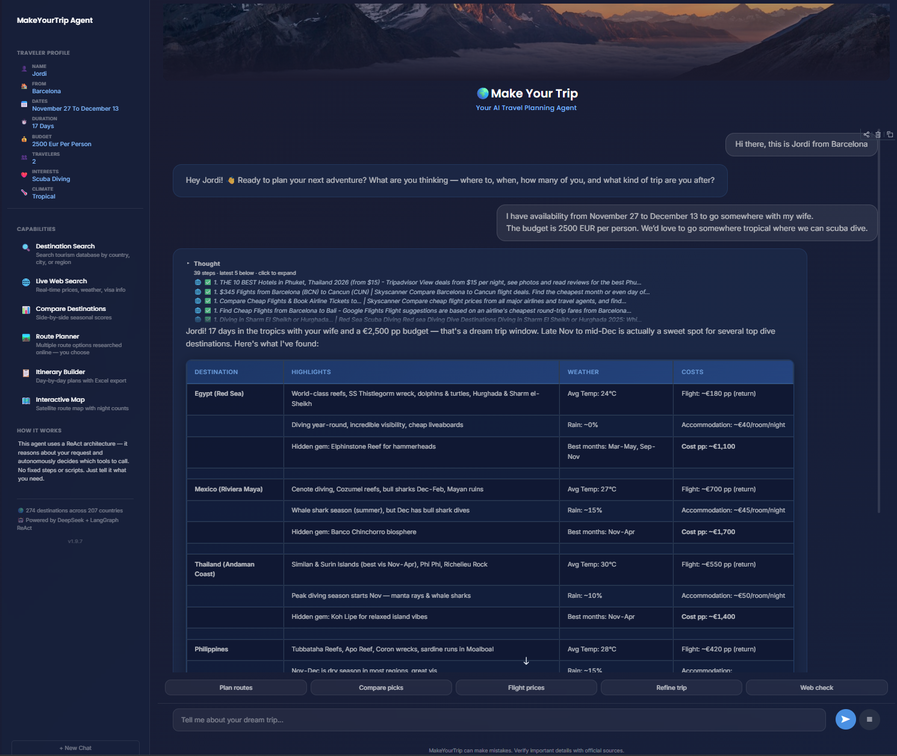
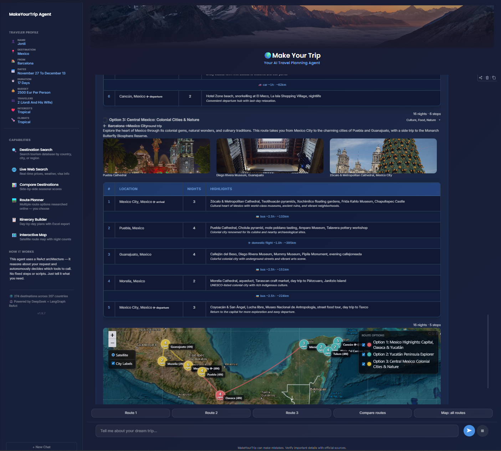
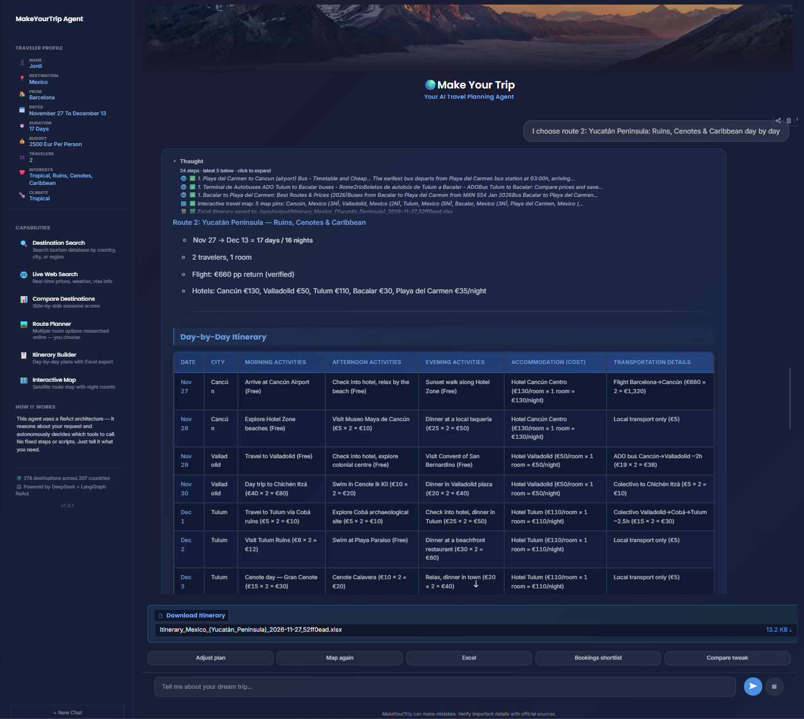
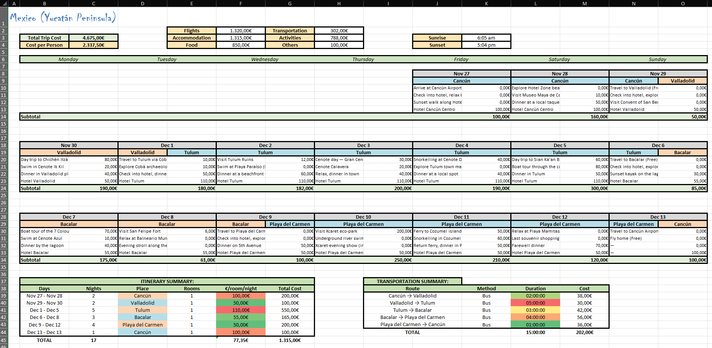
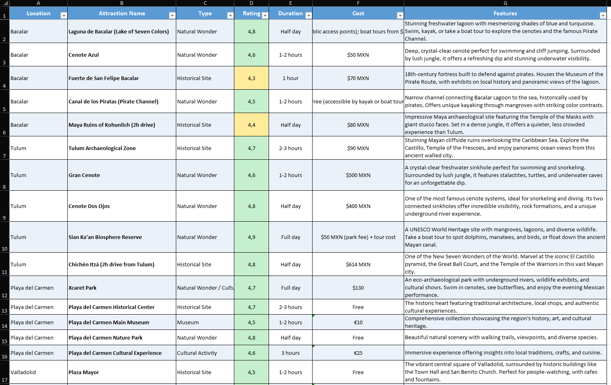
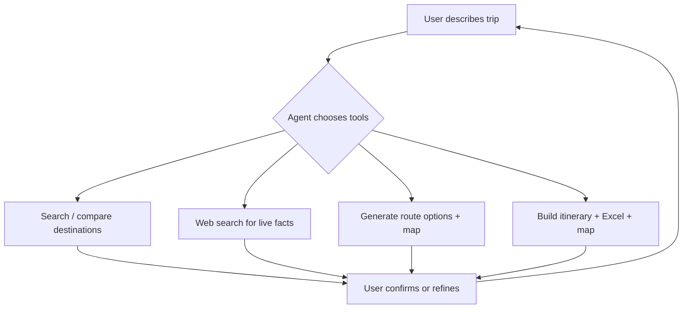
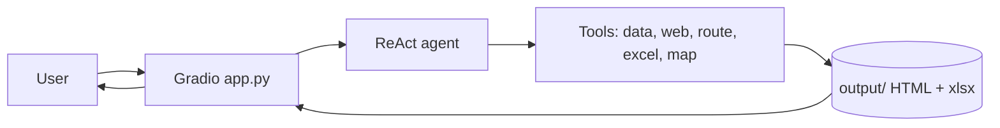

# MakeYourTrip - AI Travel Planning Assistant

An intelligent travel planning assistant powered by **GPT-4o-mini**, **LangChain**, and **LangGraph** (ReAct) with a **Gradio** web UI. You describe your trip in natural language; the agent searches a tourism-score database, runs live web lookups, proposes multi-stop routes, and produces day-by-day plans with maps and Excel export.

For access to the online Chat, please email jordisc@sole.cat.

## Showcase

### Initial trip requirements

Share dates, budget, interests, and constraints. The chat gathers what it needs and reflects your preferences in the live traveler profile while the agent plans next steps.



### Route selection

After destinations are in focus, the assistant researches popular itineraries online and presents distinct multi-stop route options with comparison context. Interactive satellite maps and route cards help you choose how you move between stops.



### Day-by-day itinerary

You get structured daily plans (morning, afternoon, evening) with realistic lodging and transport context, aligned to the route you confirmed.



### Excel export

Download a styled workbook: overview plus day-by-day sheets for budgets, logistics, and activities—ready to edit offline.



### Place-level todos

Granular checklists per stop help you track what still needs booking or confirmation before you travel.



## Features

### Planning and research

- **Destination discovery** — Search 900+ scored destinations across 100+ countries using monthly suitability scores (0–10) from the bundled tourism database.
- **Live web search** — DuckDuckGo-backed lookups for prices, weather, visa notes, and safety (snippet-first; optional deeper page extraction via environment flags).
- **Side-by-side comparison** — Compare candidate destinations for a chosen travel month.
- **Smart route planning** — Researches real-world route patterns, then synthesizes **2–4** distinct multi-stop options (minimum night rules and airport-aware routing are enforced in tooling and prompts).
- **Interactive route maps** — Folium satellite maps with toggleable layers, night-count markers, and curved route lines (geocoding via Nominatim with caching).

### Outputs and UI

- **Day-by-day itineraries** — Activities, transport, and cost-style breakdowns grounded in the selected route.
- **Excel export** — OpenPyXL workbooks with styled headers and sizing.
- **Streaming Gradio UI** — Dark glass-style interface with tool-activity indicators so you see searches, comparisons, and generations as they run.
- **Session-safe HTML** — Maps and heavy HTML outputs are isolated per session for concurrent use.

### Architecture note

There is **no fixed multi-step wizard** inside the code: one **ReAct** agent (LangGraph) decides **when** and **which** tools to call from conversation context. The flow below is the logical journey users typically experience, not a hardcoded state machine.

## Project structure

```
MakeYourTrip_Agent/
├── agent.py                # ReAct agent (CLI + build_agent)
├── app.py                  # Gradio web UI (streaming, theme, profile sidebar)
├── prompts.py              # System prompt and output conventions
├── conversation_logger.py  # Session logging (JSONL, profile, metadata)
├── chat_handler.py         # Message handling, streaming, tool trace UX
├── tools/
│   ├── data_tools.py       # Tourism DB: search, top-N, compare
│   ├── search_tools.py     # DuckDuckGo web search (timeouts / batching)
│   ├── route_tools.py      # Route research, synthesis, map + cards
│   ├── output_tools.py     # Excel itinerary export
│   ├── map_tools.py        # Folium map generation
│   ├── geo_utils.py        # Geocoding + curve helpers
│   └── session_store.py    # Per-session HTML isolation
├── data/
│   └── region_tourism_score.xlsx
├── output/                 # Generated maps & Excel (often gitignored)
└── requirements.txt
```

## Getting started

1. **Python environment**

   ```bash
   python -m venv venv
   venv\Scripts\activate
   pip install -r requirements.txt
   ```

2. **Environment variables**

   Create a `.env` in the project root:

   ```
   OPENAI_API_KEY=sk-your-key-here
   ```

   Optional tuning (timeouts, MCP web extraction, tool-trace visibility) is documented in the main `README.md`.

3. **Tourism data**

   Place `region_tourism_score.xlsx` under `data/` (see main README for required columns).

4. **Run the app**

   ```bash
   python app.py
   ```

   Open the URL shown in the terminal (default [http://localhost:7860](http://localhost:7860)).

   **CLI only:** `python agent.py`

## How it works

### 1. Typical conversation arc


```mermaid
graph TD
    A[User describes trip] --> B{Agent chooses tools}
    B --> C[Search / compare destinations]
    B --> D[Web search for live facts]
    B --> E[Generate route options + map]
    B --> F[Build itinerary + Excel + map]
    C --> G[User confirms or refines]
    D --> G
    E --> G
    F --> G
    G --> A
```

### 2. High-level data flow


```mermaid
flowchart LR
  U[User] --> G[Gradio app.py]
  G --> A[ReAct agent]
  A --> T[Tools: data, web, route, excel, map]
  T --> O[(output/ HTML + xlsx)]
  O --> G
  G --> U
```

### 3. Key components

| Piece | Role |
|-------|------|
| `create_react_agent` (LangGraph) | Decides tool calls from context |
| `data_tools` | Tourism scores, lists, comparisons |
| `search_tools` | Web search for fresh prices and facts |
| `route_tools` | Online route research + multi-stop options + map HTML |
| `output_tools` | Excel itinerary export |
| `map_tools` | Folium maps for routes |
| `session_store` | Keeps each user’s map HTML separate |

## Technical stack

| Area | Technology |
|------|------------|
| UI | Gradio 5+ |
| Agent | LangChain + LangGraph (ReAct) |
| LLM | OpenAI GPT-4o-mini |
| Web search | DuckDuckGo (`ddgs`) |
| Maps | Folium + Esri satellite tiles |
| Geocoding | Geopy / Nominatim |
| Data | Pandas + OpenPyXL |

## Contributing

1. Fork the repository.
2. Create a branch (`git checkout -b feature/your-feature`).
3. Commit with clear messages.
4. Open a pull request.

## License

This project is for personal and educational use unless otherwise stated by the repository owner.

## Acknowledgments

- OpenAI for the GPT API.
- LangChain and LangGraph for agent tooling.
- Gradio for the web interface.
- OpenStreetMap / Nominatim and Esri tile providers used via community libraries.
- Open-source projects listed in `requirements.txt`.

---

*To refresh screenshots, replace the PNG files in `MYT/` and keep the same filenames so image links in this document stay valid.*
